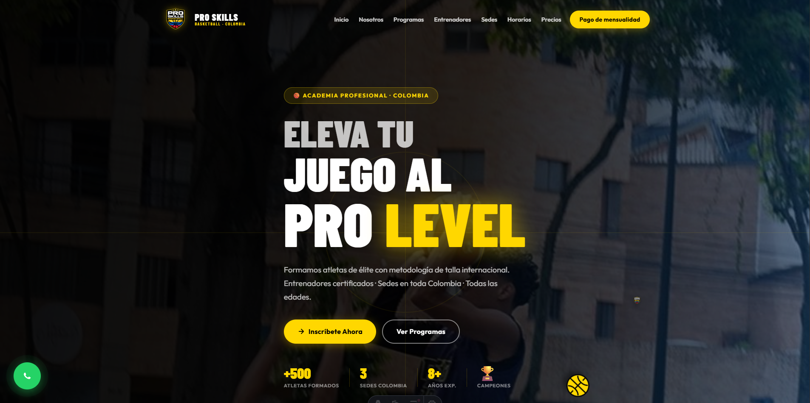
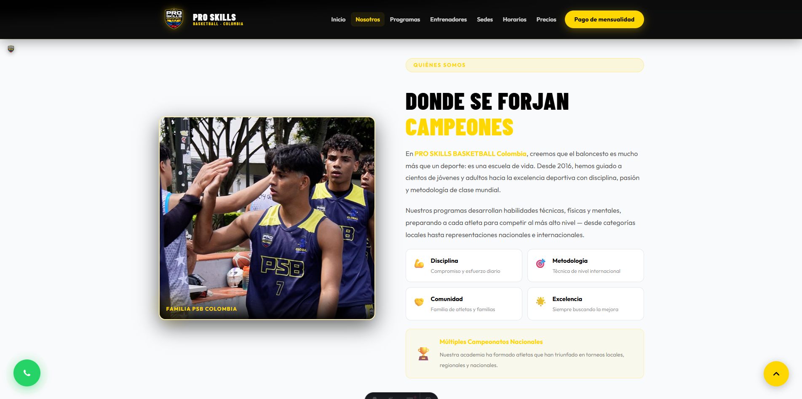
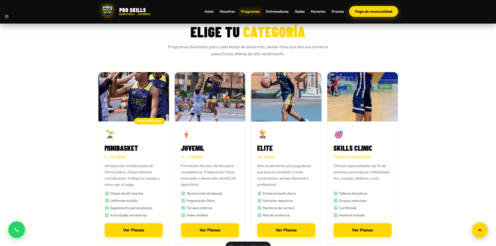
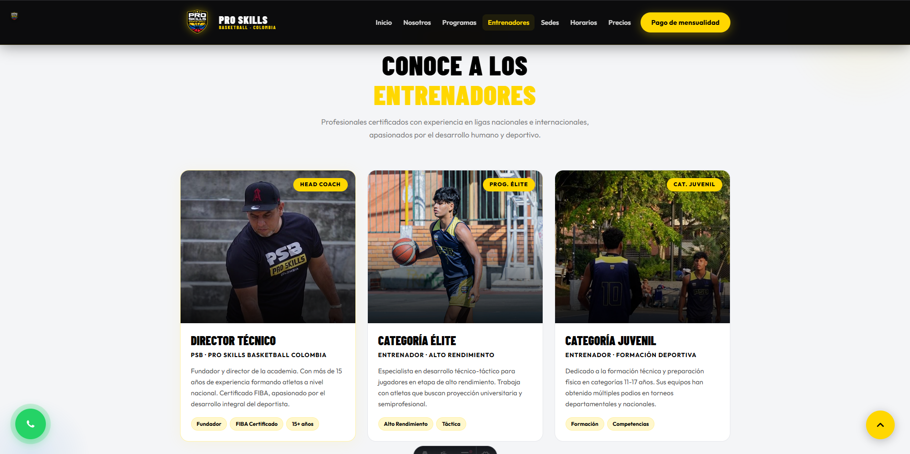
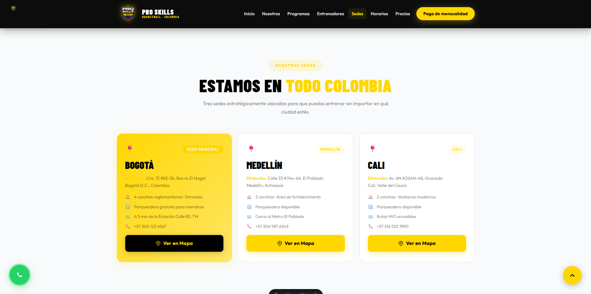
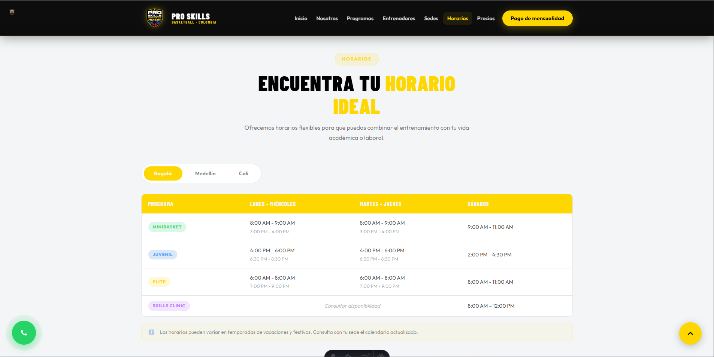
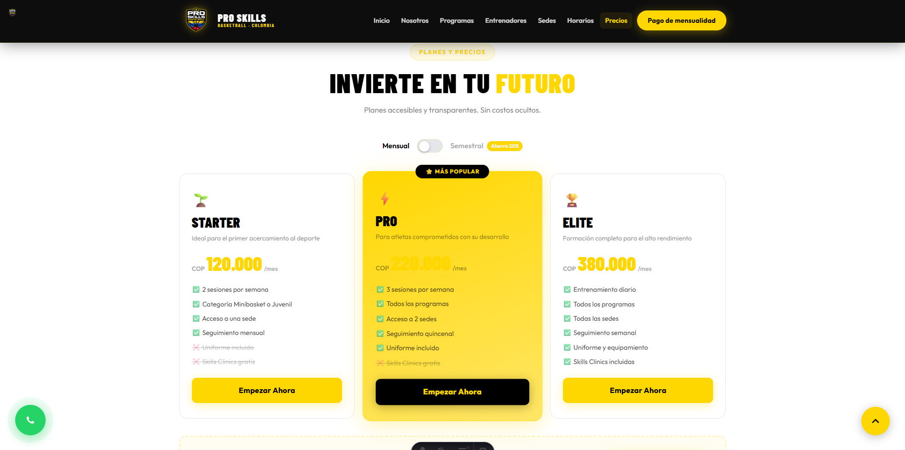
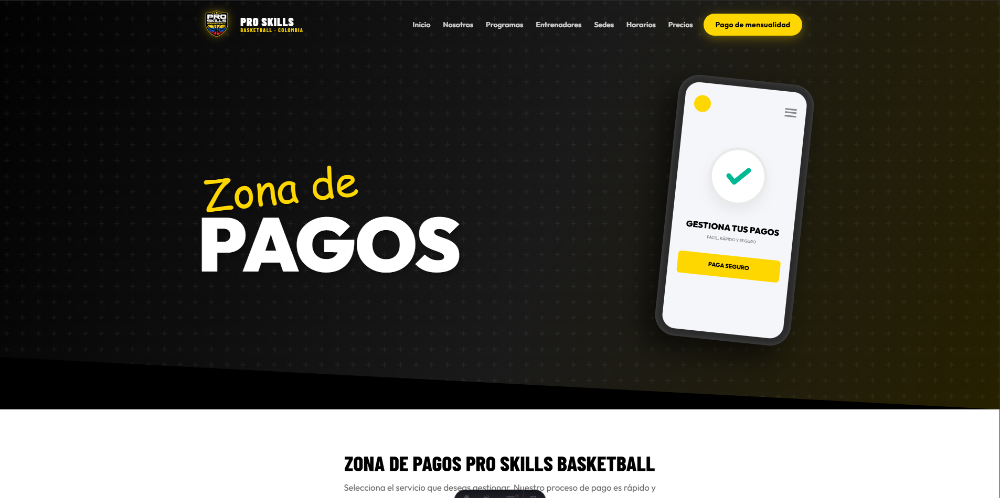
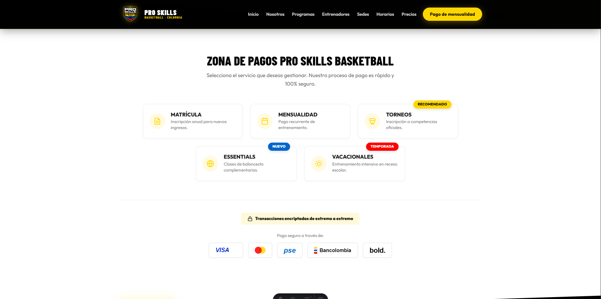

# PRO SKILLS BASKETBALL - Landing + Zona de Pagos

Sitio web oficial de PRO SKILLS BASKETBALL Colombia, construido con Astro.

Incluye:
- Landing principal con secciones de academia, programas, entrenadores, sedes, horarios, precios y contacto.
- Pagina independiente de pagos en `/pagos`.
- Estilo visual de marca (negro, dorado y amarillo) y componentes reutilizables.

## Stack

- Astro
- TypeScript
- CSS (estilos globales y por componente)

## Estructura del proyecto

```text
/
├── public/
├── src/
│   ├── assets/
│   ├── components/
│   ├── layouts/
│   └── pages/
├── astro.config.mjs
├── package.json
└── tsconfig.json
```

## Comandos

Ejecuta estos comandos en la raiz del proyecto:

| Comando | Descripcion |
| :-- | :-- |
| `npm install` | Instala dependencias |
| `npm run dev` | Inicia entorno local en `http://localhost:4321` |
| `npm run build` | Genera build de produccion |
| `npm run preview` | Sirve build generado para validacion |

## Rutas principales

- `/` - Landing principal
- `/pagos` - Zona de pagos

## Capturas de pantalla

> Nota: para visualizar las capturas en GitHub, coloca los archivos en `docs/capturas/` con estos nombres.

### Landing principal









### Zona de pagos



